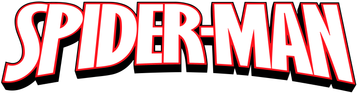

<h1 align="center">
	
  <br>
  SPIDER MAN LANDING PAGE
</h1>

<h3 align="center">
  Spidey page 🕸️🕷️ made with Tailwind
</h3>

<p align="center">Projeto realizado com NextJS + Tailwind.</p>

<p align="center">
  <a href="#-sobre-o-repositorio">👨🏻‍💻 Sobre o repositorio</a>&nbsp;&nbsp;&nbsp;|&nbsp;&nbsp;&nbsp;
  <a href="#-tecnologias">🚀 Tecnologias</a>&nbsp;&nbsp;&nbsp;|&nbsp;&nbsp;&nbsp;
  <a href="#-começando">💻 Começando</a>&nbsp;&nbsp;&nbsp;|&nbsp;&nbsp;&nbsp;
  <a href="#-licença">📝 Licença</a>
</p>

<br>


<br>

## 👨🏻‍💻 Sobre o repositorio

Resumo do projeto no [figma](https://www.figma.com/file/cG1vkCQYhXdO4i1WQG8VMI/SpideyPage?node-id=0%3A1)

## 🚀 Tecnologias

As tecnologias utilizadas nesse projeto foram:


## 💻 Começando

**Clone o projeto e instale todas as dependências**

```bash
$ git clone https://github.com/LuizSouz404/spidey-page.git

$ yarn

$ yarn dev
```

## 📝 Licença

Esse Projeto está sob a licença MIT - Veja o arquivo para detalhes [LICENSE](LICENSE)

---

Made with 💜 &nbsp;by Luiz Souza 👋 &nbsp;[See my linkedin](https://www.linkedin.com/in/luiz-augusto-souza-21a568176/)